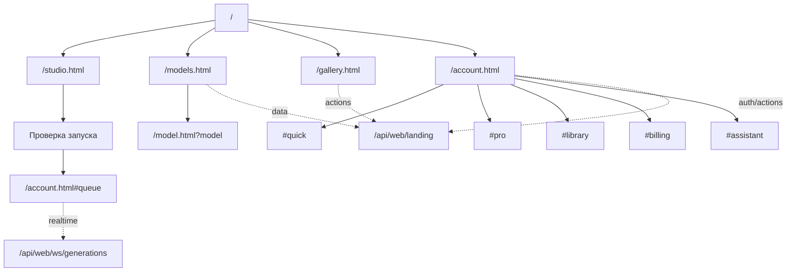

# APIX Studio: актуальная карта сайта

Дата актуализации: 2026-05-31.

## Канонические публичные URL

| URL | Назначение | Индексация | Комментарий |
| --- | --- | --- | --- |
| `/` | Главная продуктовая страница со сценариями создания | Да | Ведет в реальные разделы сайта, не заменяет кабинет. |
| `/studio.html` | Создание картинки, видео и музыки | Да | Поддерживает `type=image|video|music`, `flow=text|reference|edit`, `model`. |
| `/models.html` | Каталог моделей и возможностей | Да | Группирует варианты одной модели без дублей для пользователя. |
| `/model.html?model=<model_key>` | Обучение по конкретной модели | Да | Возможности, интерактивный маршрут, FAQ, примеры, лайфхаки и переход в Studio с готовым тестом. |
| `/gallery.html` | Галерея реальных работ и идей | Да | Карточки поддерживают лайк и запуск похожей работы после входа. |
| `/account.html` | Личный кабинет | Да | Вкладки открываются через hash: `#queue`, `#library`, `#billing`, `#assistant`. |

## Совместимые страницы

| URL | Canonical | Назначение |
| --- | --- | --- |
| `/features.html` | `/models.html` | Совместимый вход в возможности продукта. |
| `/guide.html` | `/studio.html` | Совместимый вход в маршрут создания. |
| `/contact.html` | `/account.html#assistant` | Совместимый вход в помощь и ассистента. |

## Авторизованная зона

| URL | Назначение | Комментарий |
| --- | --- | --- |
| `/account.html#quick` | Быстрый старт | Основной сценарий: идея -> модель -> проверка -> очередь. |
| `/account.html#pro` | Точные настройки | Качество, варианты и длительность без дублей основного меню. |
| `/account.html#queue` | Очередь | Готовность работ и текущие задачи. |
| `/account.html#library` | Библиотека | История, публикация, сохранение и удаление работ. |
| `/account.html#billing` | Баланс | Пакеты credits и только реально доступные способы оплаты. |
| `/account.html#referrals` | Рефералы | Ссылка, уровни, выплаты и заявки. |
| `/account.html#prompts` | Мои идеи | Сохранение и модерация пользовательских идей. |
| `/account.html#feed` | Лента работ | Лайки, шаринг и создание похожей работы. |
| `/account.html#assistant` | Помощник | Продуктовый ассистент через `/api/web/assistant`. |
| `/account.html#settings` | Помощь | Язык и справка через `/api/web/help`. |

## Служебные поверхности

| URL | Назначение | Индексация |
| --- | --- | --- |
| `/sitemap.xml` | XML sitemap публичных страниц | Да |
| `/robots.txt` | Robots policy | Да |
| `/app` | Telegram Mini App | Нет |
| `/api/web/*` | Web API сайта | Нет |
| `/api/v1/*` | Внутренние маршруты mini app/bot API | Нет |
| `/api/web/ws/generations` | Realtime статусы сайта | Нет |
| `/api/v1/ws/generations` | Внутренний realtime mini app/bot API | Нет |
| `/static/upload/*` | Пользовательские ассеты | Нет |

## Mermaid

