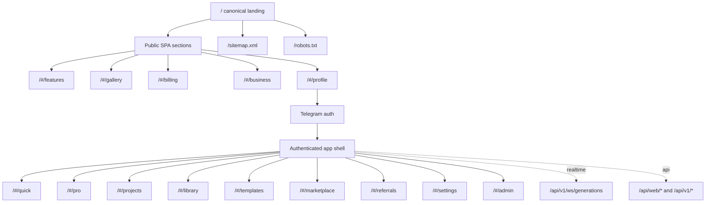

# APIX Studio: актуальная карта сайта

Дата актуализации: 2026-05-24.

## Канонический публичный URL

| URL | Назначение | Индексация | Комментарий |
| --- | --- | --- | --- |
| `/` | Основной лендинг и SPA-точка входа APIX Studio | Да | Единственный canonical URL в `landing/sitemap.xml`. |
| `/#/features` | Возможности продукта | Нет как отдельный URL | Hash-route внутри `landing/index.html`; используется для навигации, не для SEO. |
| `/#/gallery` | Галерея и примеры результатов | Нет как отдельный URL | Hash-route, алиасы: `/#/examples`, `/#/feed`. |
| `/#/billing` | Тарифы, баланс, апгрейд | Нет как отдельный URL | До входа - тарифы; после входа - баланс и транзакции. |
| `/#/business` | B2B/командные сценарии | Нет как отдельный URL | Публичная секция в SPA. |
| `/#/profile` | Вход через Telegram / профиль | Нет как отдельный URL | После авторизации ведет в app-shell. |

## Авторизованная web-app зона

| URL | Назначение | Сегмент | Комментарий |
| --- | --- | --- | --- |
| `/#/quick` | Быстрый запуск генерации | Новичок / оба | Простые действия: картинка, фото-видео, видео, редактирование фото. |
| `/#/pro` | PRO Studio | Pro | Полные настройки моделей, референсов, качества, batch и video duration. Алиас: `/#/studio`. |
| `/#/projects` | Проектный контекст | Pro / оба | Раздел предусмотрен в навигации; требует дальнейшего развития project/session/version model. |
| `/#/library` | Моя библиотека | Оба | История и результаты пользователя. Алиас: `/#/works`. |
| `/#/templates` | Шаблоны и prompt catalog | Оба | Алиас: `/#/prompts`. |
| `/#/marketplace` | Маркетплейс шаблонов/пресетов | Оба | Product surface для curated presets. |
| `/#/referrals` | Реферальная программа | Оба | Привязано к billing/growth механикам. |
| `/#/settings` | Настройки аккаунта | Оба | Профиль, язык, web session state. |
| `/#/admin` | Админ-поверхность | Admin | Доступ должен контролироваться backend-правами. |

## Служебные поверхности

| URL | Назначение | Индексация | Комментарий |
| --- | --- | --- | --- |
| `/sitemap.xml` | XML sitemap | Да | Отдает только canonical landing URL. |
| `/robots.txt` | Robots policy | Да | Запрещает crawl для API, mini app и пользовательских uploads. |
| `/app` | Telegram Mini App | Нет | Отдельная поверхность, не часть публичного лендинга. |
| `/api/web/*` | Web API для лендинга/app-shell | Нет | Служебный API. |
| `/api/v1/*` | Основной API web studio | Нет | Auth, models, generations, billing и realtime. |
| `/api/v1/ws/generations` | WebSocket статусы генераций | Нет | Realtime queue/progress для UX без refresh. |
| `/static/upload/*` | Пользовательские ассеты | Нет | Не индексировать без отдельной политики публикации. |

## Legacy HTML

| URL | Статус | Рекомендация |
| --- | --- | --- |
| `/features.html` | Legacy | Не включать в XML sitemap; позже заменить редиректом на `/#/features` или обновить как отдельную SEO-страницу. |
| `/guide.html` | Legacy | Не включать в XML sitemap до актуализации контента. |
| `/contact.html` | Legacy | Не включать в XML sitemap до решения по публичному contact/support flow. |
| `/account.html` | Legacy | Не включать в XML sitemap; текущий вход живет в SPA через Telegram auth config. |

## Mermaid

