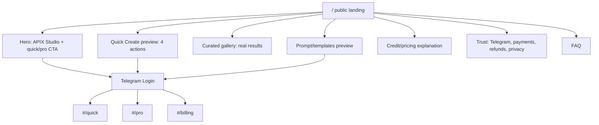
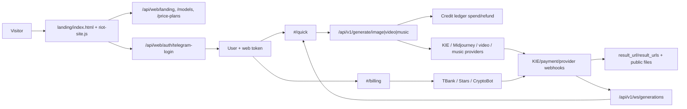

# Аналитический отчет по лендингу APIX Studio / artflow

Дата: 2026-05-24  
Фокус: публичный лендинг standalone web-версии в `landing/`, а не полный продуктовый app-shell.

## 1. Executive summary

APIX Studio стоит позиционировать не как "бот с сайтом", а как строгую AI media studio с быстрым входом через Telegram и понятным разделением: быстрый сценарий для новичка и PRO Studio для тех, кому нужны модели, референсы, версии и параметры. Для лендинга это означает не длинную маркетинговую витрину, а первый экран с ясным offer, реальными результатами, прозрачной стоимостью и быстрым CTA в создание.

Самые полезные эталоны для лендинга: Runway, Krea, Luma, Adobe Firefly и Canva Magic Studio. Runway полезен как пример профессионального workflow: генерация, итерация, Use-actions, assets/sessions и прозрачные credit costs в help center. Runway явно показывает стоимость Gen-4 Image и Gen-4 Video в кредитах, а также рекомендует сначала тестировать Turbo для быстрых итераций [Runway Gen-4 Image](https://help.runwayml.com/hc/en-us/articles/37053594806419-Creating-with-Gen-4-Image), [Runway Gen-4 Video](https://help.runwayml.com/hc/en-us/articles/37327109429011-Creating-with-Gen-4-Video). Для APIX это важнее визуального эффекта: лендинг должен обещать контролируемый процесс, а не "магию".

Krea полезен как эталон product-led landing: сразу видны модели, compute units, realtime generation, upscale, LoRA, video и priority queues на Pro [Krea Pricing](https://www.krea.ai/pricing), [Krea Image Docs](https://docs.krea.ai/user-guide/features/krea-image). Для APIX стоит взять логику "возможности раскрываются через понятные сценарии", но не копировать перегруженность feature matrix.

Luma полезна для pricing-блока и доверия: официальный pricing показывает не только планы, но и cost per video/image generation, top-ups, fast/relaxed mode, business features, usage analytics and spend limits [Luma Pricing](https://lumalabs.ai/pricing), [Luma Dream Machine pricing](https://lumalabs.ai/learning-hub/dream-machine-support-pricing-information). Для APIX это сильный сигнал: цены и списание кредитов должны быть рядом с CTA, а не спрятаны после входа.

Midjourney Web важен не как лендинг-эталон, а как паттерн post-result workflow: Create, Organize, Editor, rerun, use prompt, edit, trash and stealth features [Midjourney Creating on Web](https://docs.midjourney.com/hc/en-us/articles/33390732264589-Creating-on-Web), [Midjourney Editor](https://docs.midjourney.com/hc/en-us/articles/32764383466893-Full-Editor). Для лендинга APIX это превращается в обещание "результат не теряется: его можно оживить, сделать вариант, сохранить и вернуться".

Canva и Adobe Firefly полезны для trust layer. Canva продает AI как часть привычного visual workflow, акцентируя "all in one place", команды, brand consistency, админ-контроли и privacy controls [Canva Magic Studio](https://www.canva.com/magic/). Adobe Firefly показывает сильную enterprise-логику: web/mobile/desktop, generative credits, Standard/Pro/Premium, video/audio limits и commercial-safe positioning [Adobe Firefly Plans](https://www.adobe.com/products/firefly/plans.html), [Adobe Generative Credits FAQ](https://helpx.adobe.com/firefly/using/generative-credits-faq.html). APIX не должен копировать enterprise-тон Adobe, но должен забрать ясность: права, кредиты, приватность, платежи, история.

Рекомендованный product direction для лендинга: "APIX Studio — AI-студия для изображений и видео: быстрый результат за минуту, полный контроль в PRO". Первый экран должен быть не абстрактным hero, а рабочим preview: слева короткое позиционирование и CTA, справа визуальный фрагмент интерфейса Quick Create/результата. Тон: уверенный, профессиональный, без "волшебства", "революции" и лишней эмоциональной гиперболы.

Главный компромисс: лендинг должен продавать workflow, но не раскрывать всю сложность. На public-page показываем 4 быстрых действия, галерею, pricing, trust/security, FAQ и понятный Telegram Login. PRO Studio описываем как второй уровень: модели, референсы, версии, queue, batch, история. Не надо превращать лендинг в документацию по моделям.

**Что делать в первую очередь:** заменить общий hero на конкретный offer + рабочий preview; добавить блок "4 быстрых действия"; вынести тарифы и кредитную механику до авторизации; использовать реальные curated результаты из feed; добавить trust-блок про Telegram login, общий баланс, списание до запуска, возврат при ошибке; сделать отдельный CTA "Создать быстро" и вторичный "Открыть PRO Studio".

## 2. Краткий backend-контекст для лендинга

Текущий backend уже дает лендингу больше, чем обычная статическая витрина:

| Что уже есть | Значение для лендинга | Источник в проекте |
|---|---|---|
| Web auth через Telegram Login Widget и web token | Можно делать CTA "Войти через Telegram" и сразу переводить в studio-mode | `api/web/auth.py`, `api/miniapp_auth.py` |
| `/api/web/models`, `/api/v1/models/*` | Можно показывать реальные классы возможностей без hardcode моделей | `api/web/models.py`, `api/miniapp_routes.py` |
| Price plans и model costs | Можно показывать кредиты и стартовые цены до запуска | `db.models.PricePlan`, `ModelCost`, `api/web/models.py` |
| Генерация image/video/music | Лендинг может обещать не только картинки, но и animate/photo-to-video/music | `POST /api/v1/generate/*` |
| Credit ledger и atomic spend/refund | Можно строить trust microcopy: "стоимость видна до запуска; при ошибке кредиты возвращаются" | `db/repository.py` |
| Feed, prompt library, history | Можно подмешивать реальные примеры и шаблоны в public blocks | `api/web/feed.py`, `api/web/prompts.py`, `api/web/history.py` |
| WebSocket status | После логина можно показать active jobs без refresh | `api/realtime.py`, `docs/realtime_generation_events.md` |

Ограничения для лендинга: нет полноценной public pricing narrative поверх credit costs; curated gallery зависит от качества публичного feed; project/version model есть частично через `Generation.parent_generation_id`, `ImageSession`, `action_type`, но не как полноценные проекты; Google/email auth и passkey пока не являются готовым primary flow.

Технические риски: не дублировать mini app и standalone site; не менять Telegram bot flows; не показывать устаревшие цены статикой; не обещать batch/version tree шире, чем backend реально поддерживает. Для public landing все backend-зависимые числа лучше брать из API или формулировать как "от N кредитов", если расчет зависит от модели/разрешения.

Что достроить для сильного лендинга: `GET /api/web/landing` с curated examples, featured prompts, public price summary, model family summary; стабильный fallback для отсутствующих media; события аналитики без токенов; явная политика refunds/failed jobs в FAQ; SEO-friendly static copy и OG images.

## 3. Приоритетный список аналогов

| Сервис | Почему релевантен для лендинга APIX | URL | Уверенность | Источники |
|---|---|---:|---|---|
| Runway | Профессиональная AI video/image studio, хорошо раскрывает workflow, credits, post-result actions | https://runwayml.com/ | Высокая | [Gen-4 Image](https://help.runwayml.com/hc/en-us/articles/37053594806419-Creating-with-Gen-4-Image), [Gen-4 Video](https://help.runwayml.com/hc/en-us/articles/37327109429011-Creating-with-Gen-4-Video) |
| Midjourney Web | Сильный Create/Organize/Edit lifecycle, вариации и reuse prompt | https://www.midjourney.com/ | Высокая | [Creating on Web](https://docs.midjourney.com/hc/en-us/articles/33390732264589-Creating-on-Web), [Plans](https://docs.midjourney.com/docs/plans) |
| Leonardo AI | Массовая image/video/design платформа с canvas, motion, tokens | https://leonardo.ai/ | Средняя | [Pricing](https://leonardo.ai/pricing), [Token usage](https://intercom.help/leonardo-ai/en/articles/8044033-token-usage) |
| Krea | Product-led AI suite: realtime, image, video, enhance, LoRA, compute units | https://www.krea.ai/ | Высокая | [Pricing](https://www.krea.ai/pricing), [Image docs](https://docs.krea.ai/user-guide/features/krea-image), [Enhancer](https://docs.krea.ai/user-guide/features/enhancer) |
| Luma Dream Machine | Сильный pricing/credit transparency, image/video/audio models, business plans | https://lumalabs.ai/ | Высокая | [Pricing](https://lumalabs.ai/pricing), [Credit system](https://lumalabs.ai/learning-hub/dream-machine-credit-system) |
| Kaiber Superstudio | Видео-ориентированный canvas, credit packs, studio positioning | https://www.kaiber.ai/ | Средняя | [Superstudio](https://www.kaiber.ai/), [Plans](https://helpcenter.kaiber.ai/help/articles/6291249-kaiber-plans-what-you-need-to-know), [Pricing help](https://helpcenter.kaiber.ai/articles/10001319-understanding-subscriptions-and-pricing) |
| Playground AI | Простая design/editor подача, templates/remix; часть данных закрыта за app | https://playground.com/ | Средняя | [Help: paid limits](https://help.playgroundai.com/en/articles/11165689-how-many-images-or-edits-under-the-paid-plans-pro-day-pass), [App Store official listing](https://apps.apple.com/us/app/playground-ai-design-editor/id6478421458) |
| StableStudio | Не лендинг-эталон, но полезен как open-source studio architecture reference | https://github.com/Stability-AI/StableStudio | Высокая | [GitHub](https://github.com/Stability-AI/StableStudio), [Stability announcement](https://stability.ai/news/stablestudio-open-source-community-driven-future-dreamstudio-release) |
| Adobe Firefly | Trust, commercial-safe positioning, plan/credit clarity, enterprise confidence | https://www.adobe.com/products/firefly.html | Высокая | [Plans](https://www.adobe.com/products/firefly/plans.html), [Credits FAQ](https://helpx.adobe.com/firefly/using/generative-credits-faq.html) |
| Canva Magic Studio | "AI inside workflow", templates, brand/team trust, non-pro onboarding | https://www.canva.com/magic/ | Высокая | [Magic Studio](https://www.canva.com/magic/), [Newsroom launch](https://www.canva.com/en_in/newsroom/news/magic-studio/) |
| Freepik AI Suite | Полезен для marketplace/stock-like content positioning и simple pricing, но менее близок к pro studio | https://www.freepik.com/ | Средняя | Официальный pricing/product pages доступны, но детальные workflow хуже подтверждены открыто |

## 4. Пользовательские потоки конкурентов: только то, что влияет на лендинг

| Сервис | Quick create сигнал | PRO/workflow сигнал | Pricing/limits сигнал | Remix/refinement сигнал | Что брать для APIX landing | Что не копировать |
|---|---|---|---|---|---|---|
| Runway | Dashboard starts with Generate Image/Video; docs описывают шаги prompt → settings → generate | Sessions/assets, model selector, resolution, seed, Use actions | Credit cost per image/video second открыт в help center [Runway Gen-4 Video](https://help.runwayml.com/hc/en-us/articles/37327109429011-Creating-with-Gen-4-Video) | Vary, Use, upscale, retime, expand, assets | Блок "от идеи до результата и следующего шага"; прозрачная цена | Слишком много model jargon на первом экране |
| Midjourney Web | Create page как hub для генерации [Midjourney Create](https://docs.midjourney.com/hc/en-us/articles/33390732264589-Creating-on-Web) | Organize/Edit, stealth, advanced prompt controls | Plans по GPU time и режимам [Midjourney Plans](https://docs.midjourney.com/docs/plans) | rerun/use prompt/editor/vary region | Обещание "каждый результат можно продолжить" | Не копировать Discord/MJ-specific терминологию |
| Krea | Realtime as you type/draw, daily credits [Krea Pricing](https://www.krea.ai/pricing) | LoRA, all video models, priority queues, 22K upscale | Compute units, plan tiers, business plan | Upscale/enhance sends output to next tool [Krea Image](https://docs.krea.ai/user-guide/features/krea-image) | "быстрый старт без prompt engineering" + "потом контроль" | Не перегружать лендинг длинной матрицей моделей |
| Luma | Try for free, model/action pricing | Agents, guest collaborators, business usage analytics/spend limits [Luma Pricing](https://lumalabs.ai/pricing) | Cost per second/image, top-ups, relaxed mode [Luma Credit System](https://lumalabs.ai/learning-hub/dream-machine-credit-system) | Board/Ideas, Modify/Reframe/Upscale | Pricing transparency и top-up logic | Не делать pricing слишком инженерным |
| Kaiber | Superstudio обещает image/video/sound в canvas [Kaiber](https://www.kaiber.ai/) | High-volume studio quote, flex packs | Credit cost next to generation button [Kaiber Plans](https://helpcenter.kaiber.ai/help/articles/6291249-kaiber-plans-what-you-need-to-know) | Видео/музыка/звук как studio flow | "стоимость рядом с кнопкой" | Не уходить в music-video niche как главный narrative |
| Leonardo | AI tools across image/video/design; token model | Realtime Canvas, Motion, API/team plans | Tokens vary by feature [Token usage](https://intercom.help/leonardo-ai/en/articles/8044033-token-usage) | Canvas iteration, motion | Feature breadth, but только как proof | Не делать "всё для всех" без clear primary task |
| Playground | Templates, remix, edit by asking, simple creator positioning [App Store](https://apps.apple.com/us/app/playground-ai-design-editor/id6478421458) | Less confirmed web PRO workflow | Paid limits in help center [Playground help](https://help.playgroundai.com/en/articles/11165689-how-many-images-or-edits-under-the-paid-plans-pro-day-pass) | Infinite revisions/remix claimed in official app listing | Шаблоны как анти-blank-page | Не копировать consumer-toy tone |
| Adobe Firefly | Text-to-image/generative fill/video in web app | Creative Cloud integration, partner models, video/audio | Standard/Pro/Premium credits and limits [Firefly Plans](https://www.adobe.com/products/firefly/plans.html) | Generative fill/edit workflows | Trust, plan clarity, commercial confidence | Не копировать Adobe complexity |
| Canva | "start with an idea", templates, no complex skills [Canva Newsroom](https://www.canva.com/en_in/newsroom/news/magic-studio/) | Brand consistency, teams, admin controls, privacy | Premium AI tools and plan gating [Canva Magic Studio](https://www.canva.com/magic/) | Edit/refine inside visual suite | Простая формулировка для non-pro | Не становиться design-suite вместо AI studio |
| StableStudio | Open-source quick interface | Plugins/backend swap [StableStudio GitHub](https://github.com/Stability-AI/StableStudio) | Billing removed from OSS | Create/edit generated images | Архитектурный reference | Не использовать как визуальный эталон лендинга |

## 5. UI-паттерны для landing comparison

| Паттерн | Где сильный | Где перегружен | Подходит APIX | Рекомендация |
|---|---|---|---|---|
| Hero | Runway/Krea/Luma: продукт и модель возможностей читаются сразу | Canva может быть слишком broad для AI studio | Да | Hero = offer + visual proof + 2 CTA: "Создать быстро" и "PRO Studio" |
| Visual proof | Runway docs/screens, Krea examples, Canva feature demos | Generic abstract gradients | Да | Использовать реальные feed examples или curated renders, не декоративные blobs |
| Quick actions | Canva, Playground | Если превращается в карточки без действия | Да | 4 actions: создать картинку, оживить фото, сделать видео, изменить фото |
| PRO teaser | Runway/Krea/Midjourney | Длинные списки параметров | Да | Короткая табличка: модели, refs, queue, versions, batch, pricing before run |
| Pricing display | Luma/Adobe/Krea | Luma может быть слишком detailed | Да | 3-4 тарифа + "кредиты списываются по модели; цена видна до запуска" |
| Trust/security | Adobe/Canva | Если слишком enterprise-heavy | Да | Telegram auth, общий баланс, возврат при ошибке, приватность, платежи |
| Gallery cards | Midjourney/Canva/Runway | Feed без качества и отбора | Да | Только curated results; bad feed лучше не показывать |
| Template cards | Canva/Playground | Если шаблоны выглядят как marketplace ради marketplace | Да | "Старт без prompt engineering": 6-9 шаблонов |
| Onboarding modal | Midjourney/Create docs imply guided actions | Модалки до понимания ценности | Частично | На лендинге без модалок; после login — lightweight Quick Create |
| App preview | Runway/Krea/Luma | Fake UI без связи с реальным продуктом | Да | Показывать реальный UI-фрагмент из `landing/` или generated screenshot |

Вывод: для strict premium берем dense professional hero, реальные media, кредитную прозрачность, restrained cards radius 8px, сине-лиловой акцент на графитовой основе, минимум декоративных эффектов. Нельзя копировать consumer-toy language, "magic" tone, огромные feature grids, pricing без стоимости действия и abstract AI-glow visuals.

## 6. UX/UI-принципы strict premium landing

| Принцип | В интерфейсе | Good | Bad | Для APIX |
|---|---|---|---|---|
| 1. Offer до эстетики | H1 говорит, что это за продукт | "AI-студия для изображений и видео" | "Будущее креатива уже здесь" | H1: `APIX Studio` + subhead про quick/pro |
| 2. Два пути видны сразу | CTA pair | `Создать быстро` / `PRO Studio` | Один CTA "Начать" | В hero и sticky topbar |
| 3. Цена до запуска | Стоимость/кредиты рядом с action | "от 3 кредитов" | "потом узнаете" | Pricing block + FAQ |
| 4. Реальные результаты | Curated gallery | результат + task + model/cost | stock-like абстракция | брать из feed с ручным отбором |
| 5. Сложность раскрывается постепенно | PRO details ниже fold | quick cards сначала | список всех моделей в hero | быстрые сценарии выше PRO |
| 6. Микротекст без магии | Команды и состояния простые | "Кредиты вернутся при ошибке" | "AI всё сделает идеально" | trust FAQ |
| 7. Premium = контроль | Показывать queue/history/refs | "результат можно оживить" | "получите вау" | chain actions |
| 8. Typography спокойная | 1 display heading, остальное dense | 56-72 desktop H1 | гигантские карточные заголовки | без viewport-scaling font |
| 9. Spacing рабочий | 8/12/16/24 grid | контент сканируется | пустые hero gaps | лендинг короткий, плотный |
| 10. Сине-лиловой акцент дозирован | Accent only for CTA/focus | graphite + blue-violet + neutral | всё фиолетовое | заменить gold-dominance, не делать one-note purple |
| 11. Accessibility basic | focus-visible, contrast, reduced motion | все CTA keyboardable | hover-only UI | уже частично есть в CSS |
| 12. Mobile first | Hero action + preview readable | CTA above gallery | огромный hero без next section | hero 70-78svh, hint next block |
| 13. Ошибки честные | "Сервис недоступен" | fallback gallery | пустая broken image | use safe media |
| 14. Trust перед payment | auth/payment/security block | Telegram signed login | "плати сейчас" без объяснения | FAQ + billing microcopy |
| 15. Никаких fake возможностей | только подтвержденное backend | "версии v1-lite" если частично | "полные проекты" без модели | помечать roadmap |

Различие UX:

| Новичок | PRO |
|---|---|
| Видит задачи, не модели | Видит модели, параметры, refs |
| Пишет одну идею или загружает фото | Управляет aspect ratio, quality, duration, count |
| Цена на кнопке | Детальный cost breakdown |
| Результат → "вариант" / "оживить" | Result → version/history/project context |
| Язык бытовой | Язык точный, но без сырого provider jargon |

## 7. IA лендинга и sitemap

Публичная часть должна быть одной страницей с anchors или hash-routes: `home`, `features`, `gallery`, `billing`, `business`, `profile`. Авторизованный app уже может оставаться в текущем SPA: `quick`, `pro`, `projects`, `library`, `templates`, `marketplace`, `billing`.

### REST endpoints для лендинга

| Endpoint | Method | Purpose | Backend связь | Priority | Комментарий |
|---|---:|---|---|---|---|
| `/api/web/landing` | GET | Один агрегированный payload для public landing | feed, prompts, plans, models | P0 | New: уменьшит сетевые запросы и stale copy |
| `/api/web/auth/config` | GET | Telegram bot username | settings | P0 | Reuse |
| `/api/web/auth/telegram-login` | POST | Login widget → web token | User, token | P0 | Reuse |
| `/api/web/models` | GET | Summary для "модели и возможности" | ModelCost | P0 | Reuse, но нужен public-friendly summary |
| `/api/web/price-plans` | GET | Pricing cards | PricePlan | P0 | Reuse |
| `/api/web/feed?source=curated` | GET | Только качественные примеры | Generation | P1 | New/refactor: curated flag |
| `/api/web/prompts?source=featured` | GET | Шаблоны для старта | UserPrompt | P1 | New/refactor |
| `/api/web/landing/events` | POST | Analytics без секретов | event log | P2 | New |
| `/api/web/me` | GET | После login переключить UI | User | P0 | Reuse |

### WebSocket events для landing-to-app transition

| Event | Payload minimum | Publisher | Listener | UX-зачем |
|---|---|---|---|---|
| `generation.snapshot` | `items[]` | backend WS | app shell | Показать активные задачи после входа |
| `generation.updated` | `id,status,result_url,result_urls,error,credits_spent` | backend lifecycle | Quick/PRO/Library | Результат без refresh |
| `billing.updated` | `credits, transaction_id, status` | payment webhook | billing/topbar | После оплаты обновить баланс |
| `landing.authenticated` | `user, credits` | frontend | landing app state | Переключить public → app |
| `queue.recovered` | `items[]` | frontend local queue | quick/pro | Вернуть пользователя к активной работе |

## 8. Приоритетные фичи лендинга

| Фича | Сегмент | Value | Backend dependency | Риск | Почему в ранний релиз |
|---|---|---|---|---|---|
| Hero с реальным app preview | Оба | Понимание продукта за 5 секунд | Нет/curated screenshot | Low | Самый большой conversion lift |
| 4 Quick Create cards | Новичок | Убирает страх blank page | `/api/v1/generate/*` после login | Low | Прямо поддерживает главный сценарий |
| Curated gallery из feed | Оба | Доказательство качества | feed + curated policy | Med | Без примеров AI лендинг слабый |
| Pricing/credits block | Оба | Доверие до login/payment | price plans/model costs | Med | Снимает главный риск paid AI tools |
| Trust block: Telegram/login/refunds | Оба | Снижает тревожность | auth, ledger, payments | Low | Особенно важно из-за Telegram primary auth |
| Templates preview | Новичок | Быстрый старт без prompt engineering | prompt library | Med | Ведет в studio и marketplace loop |

## 9. Roadmap 30 / 60 / 90 дней для лендинга

| Период | Deliverables | Acceptance criteria | Риски |
|---|---|---|---|
| 30 дней | Новый hero, quick/pro split, pricing block, curated gallery fallback, FAQ, Telegram CTA | Гость понимает продукт на первом экране; CTA ведет в login; цены/кредиты видны до запуска; mobile 360px без overlap | Нет качественных curated results |
| 60 дней | `/api/web/landing`, curated examples admin flag, template preview, analytics events, OG image refresh | Public payload грузится одним запросом; галерея не показывает broken media; events не содержат токены; social preview корректный | Нужна легкая админка отбора |
| 90 дней | A/B hero, RU/EN parity, business/trust page sections, payment trust states, SEO sitemap/robots | Можно сравнить conversion hero A/B; RU/EN одинаково качественные; pricing не устаревает; FAQ покрывает refunds/privacy/payment | Без продуктовой аналитики сложно выбирать варианты |

## 10. Визуальные референсы

| Раздел | Reference | Что смотреть | URL | Полезность |
|---|---|---|---|---|
| Hero | Runway | Professional AI video positioning, workflow seriousness | https://runwayml.com/ | Высокая |
| Hero | Krea | Product-led AI suite, realtime/value clarity | https://www.krea.ai/ | Высокая |
| Hero | Luma | Cinematic production-grade visual tone | https://lumalabs.ai/ | Высокая |
| Quick actions | Canva Magic Studio | Понятный AI для широкой аудитории | https://www.canva.com/magic/ | Высокая |
| Quick actions | Playground | Template-first anti-blank-page | https://apps.apple.com/us/app/playground-ai-design-editor/id6478421458 | Средняя |
| Workspace teaser | Midjourney Create | Create hub, actions around outputs | https://docs.midjourney.com/hc/en-us/articles/33390732264589-Creating-on-Web | Высокая |
| Controls | Runway Gen-4 Video docs | Prompt/settings/generate/iterate | https://help.runwayml.com/hc/en-us/articles/37327109429011-Creating-with-Gen-4-Video | Высокая |
| Refinement | Midjourney Editor | Edit/remix/pan/zoom workflow | https://docs.midjourney.com/hc/en-us/articles/32764383466893-Full-Editor | Высокая |
| Pricing | Luma Pricing | Cost per action and business plans | https://lumalabs.ai/pricing | Высокая |
| Pricing | Adobe Firefly Plans | Tiered credits and limits | https://www.adobe.com/products/firefly/plans.html | Высокая |
| Trust | Canva Shield | AI/privacy/admin control messaging | https://www.canva.com/magic/ | Высокая |
| Architecture | StableStudio | Plugin-oriented studio thinking | https://github.com/Stability-AI/StableStudio | Средняя |

## 11. Монетизация и тарифы для landing

Цены ниже — продуктовая рекомендация для web-позиционирования, не текущий факт backend.

| Tier | Пример цены | Кому подходит | Что входит | Ограничения | Rationale |
|---|---:|---|---|---|---|
| Free / Trial | 0 ₽ | Новички | 10-20 стартовых кредитов, watermark-free для low-cost images, Telegram login | Без video-heavy моделей или с малым лимитом | Нужно снизить барьер первого результата |
| Creator | 990 ₽/мес | Индивидуальные creators | 300-500 кредитов, image/edit, basic video, templates | Нет batch/high priority | Ближе к Adobe/Krea entry paid, но локально доступнее |
| Pro | 2 490 ₽/мес | Активные пользователи | 1 500-2 000 кредитов, video, refs, PRO controls, priority queue | Fair use на high-cost models | Основной premium tier |
| Studio | 6 900 ₽/мес | Малые команды/агентства | 6 000+ кредитов, shared workspace позже, higher concurrency, коммерческие сценарии | Без enterprise SSO | Захватывает production users |
| Business | от 25 000 ₽/мес | Команды | invoice, limits, seats, curated support, no-training terms при готовности | Требует ops/support | Берем логику Luma/Canva/Adobe enterprise trust |
| Top-ups | 390/990/2 990 ₽ | Все | Разовые credits packs | Не заменяет subscription benefits | Нужны для video spikes |

Логика: подписка дает предсказуемость и retention, credits дают контроль себестоимости, top-ups закрывают дорогие видео/4K, business tier отделяет командные требования. На лендинге надо показывать простую матрицу: "план → кредиты → примерный объем", плюс дисклеймер "точная стоимость видна до запуска".

## 12. Security / ops checklist для landing deployment

- [ ] Telegram Login Widget domain настроен и совпадает с production domain.
- [ ] `POST /api/web/auth/telegram-login` валидирует hash и `auth_date`.
- [ ] Web token не передается в URL; WebSocket auth первым сообщением.
- [ ] Cookies/localStorage policy описана в privacy note.
- [ ] CORS ограничен production origin.
- [ ] OG images абсолютные и доступны без auth.
- [ ] `/api/web/landing` не отдает приватные prompts/media.
- [ ] Broken local media скрываются или заменяются fallback.
- [ ] Payment CTA не создает invoice без явного user action.
- [ ] Analytics не логирует token, initData, full auth payload.
- [ ] Rate limits на login, upload, generation start.
- [ ] TLS и HSTS на домене.
- [ ] Secrets не попадают в static assets.
- [ ] Error monitoring покрывает landing JS errors и API 5xx.
- [ ] `tools/codex_static_checks.sh` перед code delivery.

## 13. Интеграционные задачи с backend

| Задача | Зачем лендингу | Модули | Effort | Priority | Комментарий |
|---|---|---|---|---|---|
| `/api/web/landing` aggregate | Быстрая загрузка public home | `api/web`, repo | Med | P0 | New endpoint |
| Curated gallery flag | Не показывать случайный feed | `Generation`, admin | Med | P0 | Можно начать с manual allowlist |
| Public price summary | Не hardcode тарифы | `PricePlan`, `ModelCost` | Low | P0 | Reuse |
| Landing analytics | Понять conversion | new table/log | Med | P1 | Без секретов |
| Prompt/template featured | Starter templates | `UserPrompt` | Low | P1 | Add source=featured |
| Refund policy state | Trust FAQ facts | ledger/repo docs | Low | P1 | Формализовать microcopy |
| OG image generation/update | Social preview | static/landing | Low | P2 | Можно ручной asset |
| RU/EN copy source | Content parity | landing JS | Low | P2 | Сейчас i18n частичный |
| Business contact endpoint | Enterprise lead capture | `api/web` | Med | P2 | Можно mailto v1 |
| Admin curated surface | Управлять лендингом | admin/web | Med | P2 | Не трогать bot admin без нужды |

## 14. Data flow diagram

## 15. Какие UX-паттерны берем в v1, а какие откладываем

Берем в v1:

- Hero с реальным product preview.
- 4 quick action cards.
- Сине-лиловой акцент поверх графита, без визуального шума.
- Curated gallery вместо случайной публичной ленты.
- Pricing/credits explanation до login.
- Trust FAQ: Telegram, общий баланс, refund on failed job, privacy.
- "Результат можно продолжить" как ключевой workflow promise.
- Secondary CTA в PRO Studio без раскрытия всех настроек на public page.

Откладываем:

- Полную marketplace-витрину на лендинге.
- Подробный model catalog с техническими provider IDs.
- Enterprise landing с SSO/no-training legal claims, пока backend/process не готовы.
- Batch/version tree как public promise, пока project/version model не оформлен.
- Сложные интерактивные калькуляторы стоимости.
- Многостраничный SEO-сайт до стабилизации одного сильного home.

## 16. Заключение

Для APIX нужно строить лендинг не как красивую "AI-витрину", а как вход в рабочую студию. Основной экран должен объяснить: здесь можно быстро создать картинку или видео без выбора модели, а при необходимости перейти в PRO Studio с контролем. Лучшие ориентиры: Runway для workflow, Krea для product-led подачи, Luma для pricing transparency, Midjourney для post-result continuation, Canva/Adobe для trust.

Фаза v1: hero, quick actions, curated gallery, pricing, trust, Telegram login. Не делать слишком рано: огромный каталог моделей, полноценный enterprise раздел, сложный marketplace и обещания project/version workflow шире текущего backend. Biggest leverage: показать реальный результат и реальную стоимость до запуска, затем за один клик перевести пользователя в Quick Create.
